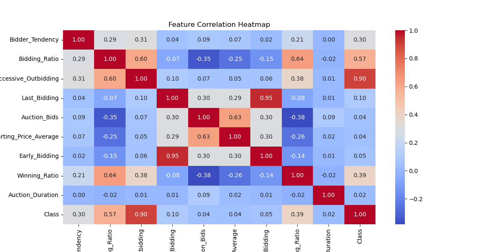
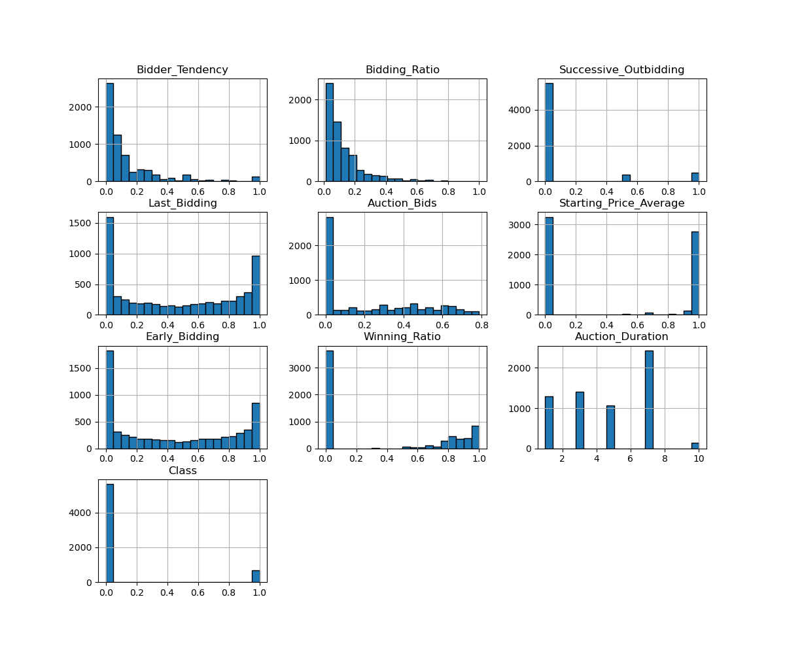
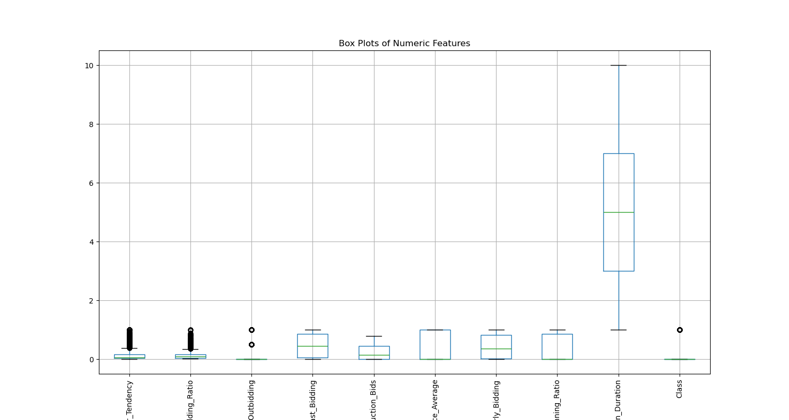
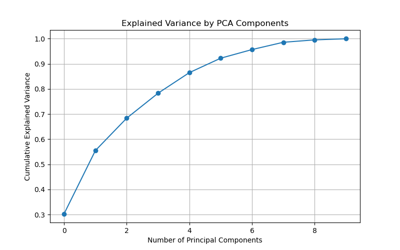
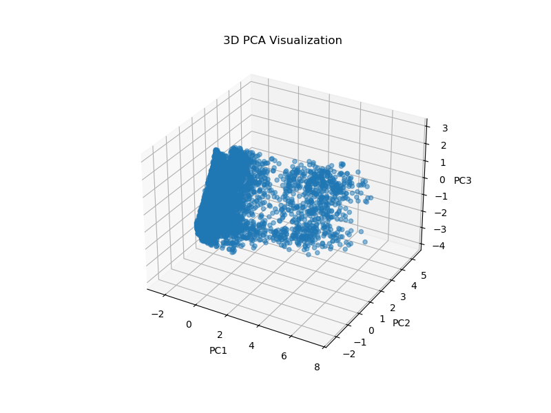

**Exploratory Data Analysis (EDA) for Shill Bidding Dataset**

The goal of this EDA is to prepare the dataset for unsupervised clustering to detect shill bidder fraud. The analysis provides data integrity, identifies potential transformations, and identifies  MinMax Scaling as a necessary process prior to clustering.

**Description**

Creators scraped a large number of eBay auctions of a popular product. After preprocessing the auction data, they created the SB dataset.   It is a multivariate dataset with 6321 instances and 13 features.

**Location**

https://archive.ics.uci.edu/dataset/562/shill+bidding+dataset

**Variable Information**

- Record ID: Unique identifier of a record in the dataset.
- Auction ID: Unique identifier of an auction.
- Bidder ID: Unique identifier of a bidder.
- Bidder Tendency: A shill bidder participates exclusively in auctions of few sellers rather than a diversified lot.  This is a collusive act involving the fraudulent seller and an accomplice.
- Bidding Ratio: A shill bidder participates more frequently to raise the auction price and attract higher bids from legitimate participants.
- Successive Outbidding: A shill bidder successively outbids himself even though he is the current winner to increase the price gradually with small consecutive increments.
- Last Bidding: A shill bidder becomes inactive at the last stage of the auction (more than 90\% of the auction duration) to avoid winning - the auction.
- Auction Bids: Auctions with SB activities tend to have a much higher number of bids than the average of bids in concurrent auctions.
- Auction Starting Price:  a shill bidder usually offers a small starting price to attract legitimate bidders into the auction.
- Early Bidding: A shill bidder tends to bid pretty early in the auction (less than 25\% of the auction duration) to get the attention of auction users.
- Winning Ratio: A shill bidder competes in many auctions but hardly wins any auctions. 
- Auction Duration:  How long an auction lasted.
- Class: 0 for normal behaviour bidding; 1 for otherwise.

**1. Data Cleaning & Preprocessing**

- Record_ID was converted to an object and set as the index, as it uniquely identifies each row and should not be included in clustering analysis.
- Auction_ID was analyzed to determine whether it should be treated as a categorical variable:
  - If Auction_ID had a reasonable number of unique values (less than 5% of dataset size), it was going to be converted to categorical, but it didn’t.  
- Verified there were no duplicate records that could bias clustering outcomes.
- Assessed missing values and confirmed that no substantial gaps required imputation.

**2. Exploratory Data Analysis**

Summary Statistics & Data Distribution
df.describe() was used to inspect key statistics (mean, min, max, standard deviation) for all numerical variables.
A correlation heatmap was generated to identify redundant features that might not contribute useful information to clustering.

Histograms provided insight into feature distributions and possible skewness.

Boxplots were used to identify extreme outliers that might impact clustering results.

Interquartile Range (IQR) Analysis quantified the number of extreme values in each feature, but no action was taken to remove outliers as they might be relevant for fraud detection.

3. Dimensionality Reduction Using PCA

Principal Component Analysis (PCA) was applied to check whether dimensionality reduction would be necessary.
  - A cumulative variance plot was generated to determine how many components explain sufficient variance:
  - If the first two components explained more than 80% of the variance, a 2D PCA plot would suffice.
  - A 3D PCA visualization was also generated to analyze data structure in three principal components.

4. MinMax Scaling

- Clustering algorithms like K-Means, DBSCAN, and Spectral Clustering use distance-based calculations, which can be biased if features have different scales.
- MinMax Scaling ensures each feature contributes equally to clustering by normalizing all values into a [0,1] range.
- StandardScaler standardizes data to zero mean and unit variance, which is ideal for PCA but unnecessary for clustering.
- MinMax Scaling preserves the original distribution and relationships between values, making it a better choice for clustering.

Note:
Additional feature engineering may be required if clustering does not yield meaningful group separations.
